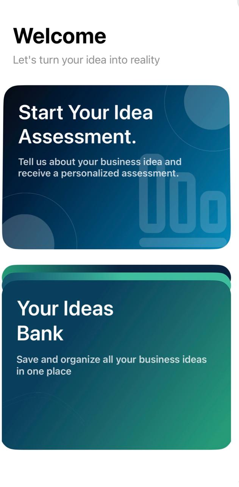
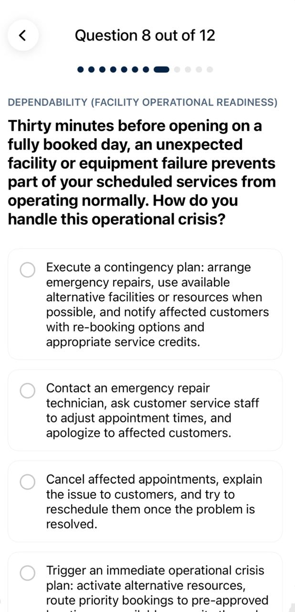
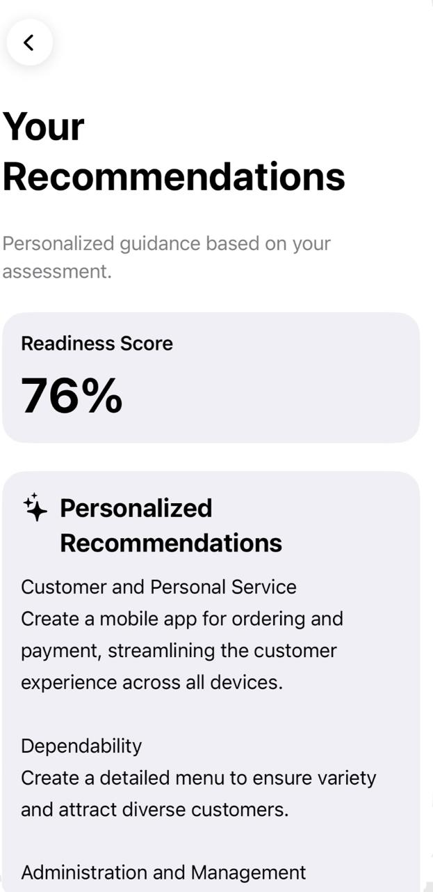
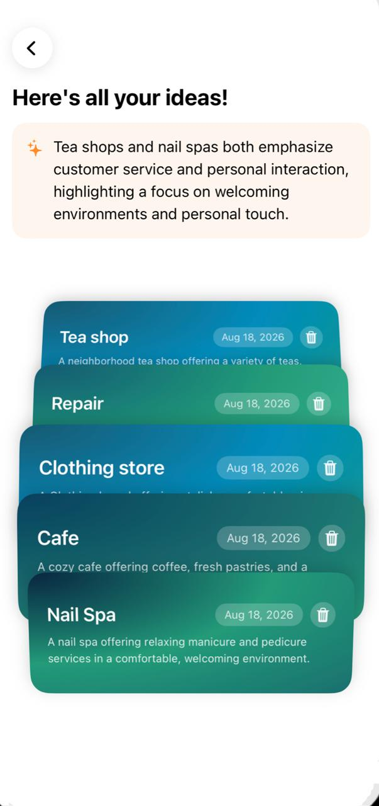

# ✦ Ideally

### Know Before You Grow

**Evaluate. Discover. Improve.**

An AI-powered platform that helps aspiring entrepreneurs
evaluate their readiness before launching their business idea.

 

---

## ✦ About

A great idea is only the beginning.

**Ideally** is an AI-powered iOS platform designed to help
aspiring and early-stage entrepreneurs evaluate their readiness
for their business ideas before launching.

Instead of focusing only on whether an idea is good, Ideally
helps entrepreneurs understand whether **they are ready for it**
by evaluating their skills, knowledge, and business readiness.

The platform then provides personalized recommendations to
help users identify areas for improvement and make more
informed decisions before investing time and resources.

---

## ✦ Why Ideally?

Entrepreneurs often focus on validating the business idea,
but may overlook their own readiness to execute it.

Ideally focuses on the **entrepreneur behind the idea**.

It helps users:

- Discover their strengths
- Identify skill gaps
- Understand their readiness
- Receive personalized recommendations
- Keep track of their business ideas

---

## ✦ Features

### 🧠 Business Readiness Assessment

An interactive assessment that evaluates key skills and
business readiness based on the user's business idea and
category.

### ✨ Personalized Recommendations

AI-powered recommendations based on the user's assessment,
helping them understand where they can improve.

### 💡 Idea Bank

Saves completed assessments as idea cards, allowing users
to organize and keep track of their business ideas in one place.

### 🔍 Idea Insights

Provides insights across saved ideas by identifying
similarities, recurring themes, and patterns.

---

## ✦ App Preview

  
  &nbsp;&nbsp;&nbsp;&nbsp;
  
  &nbsp;&nbsp;&nbsp;&nbsp;
  
  &nbsp;&nbsp;&nbsp;&nbsp;
  

  <b>Home</b>
  &nbsp;&nbsp;&nbsp;&nbsp;&nbsp;&nbsp;&nbsp;&nbsp;&nbsp;&nbsp;
  <b>Assessment</b>
  &nbsp;&nbsp;&nbsp;&nbsp;&nbsp;&nbsp;&nbsp;&nbsp;&nbsp;&nbsp;
  <b>Recommendations</b>
  &nbsp;&nbsp;&nbsp;&nbsp;&nbsp;&nbsp;&nbsp;&nbsp;&nbsp;&nbsp;
  <b>Idea Bank</b>

---

## ✦ How It Works

### 01 — Enter Your Idea

Tell Ideally about your business idea.

### 02 — Complete the Assessment

Answer questions related to your business category,
skills, knowledge, and readiness.

### 03 — Discover Your Readiness

Review your strengths and identify areas that need improvement.

### 04 — Get Personalized Recommendations

Receive recommendations based on your assessment results.

### 05 — Save Your Idea

Your completed assessment is saved to the Idea Bank,
allowing you to keep track of your business ideas.

---

## ✦ Design

Ideally follows a minimal and accessible interface inspired
by Apple's design principles.

| | |
|---|---|
| **Platform** | iOS |
| **Framework** | SwiftUI |
| **Typography** | SF Pro Text & SF Pro Display |
| **Design Approach** | Minimal & Accessible UI |

---

## ✦ Built With

- **Swift**
- **SwiftUI**
- **MLX Swift**
- **MLX Swift LM**
- **JSON**
- **Swift Package Manager**

---

## ✦ Target Users

Ideally is designed for:

- Aspiring entrepreneurs
- Early-stage entrepreneurs
- Students exploring business ideas
- Individuals who want to evaluate their readiness before launching

---

## ✦ Project Context

Ideally was developed as part of the **Apple Developer Academy**
experience using the **Challenge Based Learning (CBL)** approach.

The project combines:

**Entrepreneurship × AI × User Research × iOS Development**

to help aspiring entrepreneurs make more informed decisions
before launching their business ideas.

---

## ✦ Team 19

- **Sadeem Almohsen** — Computer Science
- **Raghad Alqahtani** — Information Technology
- **Dina Aljughayman** — Computer Science
- **Maha Bawazir** — Information Technology

---

## ✦ Project Presentation

### Ideally — Know Before You Grow

The project presentation covers the problem, research,
solution, key features, target users, and app design.

---

### Evaluate. Discover. Improve.

**Ideally — Know Before You Grow.**

